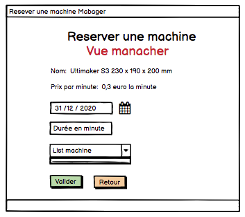

# Documentation du projet
## Introduction

## Fonctionnalités de l'application 
### Les acteurs
#### Anonyme: 
- S'identifier, s'inscrire.
- View
    - Formulaire d’authentification
    - Création d’un compte utilisateur 
#### Membre:  
- Encoder une utilisation d'un équipement. Modifier ses données.
- View
    - Liste des équipements. (encoder) **point d’entrée**
    - Encoder son utilisation.
    - La liste de ses propres utilisations.
    - Liste des factures qui le concerne
    - Formulaire pour modifier ses propres données 
    
#### Manager: 
- Créer, modifier, supprimer un équipement. 
- Encoder une utilisation d'un équipement, supprimer une utilisation.
- Génere une facture.
- Sélectionner les rôles accordés à un utilisateur.
- Modifier les données de n’importe quel utilisateur.
- View 
    - Liste des équipements. (créer, modifier, encoder) **point d’entrée**
    - Equipement 
    - Formulaire l’utilisateur
    - Encoder son utilisation
    - Liste des utilisations de tous les utilisateurs. (supprimer si pas de facture)
    - Liste des factures
    - Formulaire de facturation
    - Liste de tous les utilisateurs.
    - Modifier les données de n’importe quel utilisateur
#### Comptable:
- Supprimer facture
- View
    - Liste des **utilisations** de tous **les utilisateurs**
    - Liste des factures **point d’entrée**
    - Détail d’une facture (supprimer)
    - Liste de tous les utilisateurs.

   ### User case
   
   
   
   ### User case Membre
   
    
   ### User case Manager et Comptable
   
   
   
   
   
   ### Diagramme de Class
   
   
## Table 

## Navigation

 

### Authentification et autorisations

#### url: authtification.pug
#### url: inscription.pug

&nbsp; &nbsp; &nbsp; &nbsp; &nbsp; &nbsp;

 ### Point d’entrée pour les membres et les fablab managers
 
 #### url: machien_list.pug
 
 &nbsp; &nbsp; &nbsp; &nbsp; &nbsp; &nbsp;
 
 
 ### Encodage de l’utilisation
 
  #### Reserver une machine (membre, manager)
  #### url: machine_reserve_form_pug
  
  &nbsp; &nbsp; &nbsp; &nbsp; &nbsp; &nbsp; 
  
  
  #### Editer une machine (manager)
   #### url: machine_edit.pug
   #### url: machine_update_form.pug
   
  &nbsp; &nbsp; &nbsp; &nbsp; &nbsp; &nbsp;
  
  #### Supprimer une machine (manager)
   #### url: machine_delete.pug
   
  
  
  
  ## Structure des données
  ## Choix des techonolies
  ## Déploiement et mise à jour de l'application 
   - passport : Passport est un middleware d'authentification pour Node. Les mécanismes d'authentification sont appelés stratégies
   - passport-local : This module lets you authenticate using a **username** and **password** in your Node.js applications. 
   - exrpess-session : 
   - express-validator : express-validator is a set of express.js middlewares that wraps validator.js validator and sanitizer functions
   
  ## Difficulter rencontrer
  ## Conclusion
  
  
  
 
 
